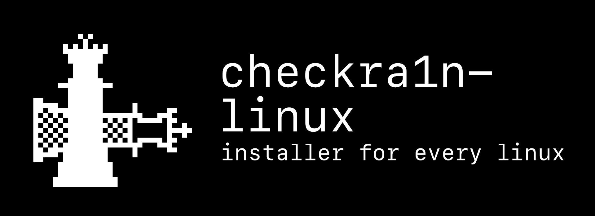

# checkra1n-linux

## a simple all-architecture checkra1n installer

Works on x86, x86_64, ARM and ARM64! On **any** Linux platform.

Like, you can run checkra1n on a rooted Android, and it will work (true story).

## one liner

run without installing:
`curl -s https://raw.githubusercontent.com/Randomblock1/checkra1n-linux/master/installer.sh | sudo bash`
(note: you can't use procursify unless you actually install it)

## install

`git clone https://github.com/Randomblock1/checkra1n-linux && cd checkra1n-linux`

`./installer.sh`

## how to use

- "Install Repository"
  - This will install the checkra1n APT repository, but only if you are using x86_64.
- "Direct Download"
  - Installs checkra1n to /usr/bin for all devices, regardless of architecture.
- "Procursify"
  - Installs the Procursus bootstrap to your device. Learn more about Procursus [here](https://github.com/ProcursusTeam/Procursus). TLDR: Replaces Substrate with libhooker and uses the Procursus repositoryfor more up-to-date programs. Also, you get Sileo, in addition to Cydia.
- “Save Blobs”
  - Saves currently signed SHSH blobs so you can upgrade/downgrade to unsigned iOS versions if you have the right blobs.
- "Credits"
  - Is self explanatory
- "Update"
  - Uses `curl` to get the latest version of this tool. You shouldn't need to use this manually, as it updates itself on startup.

If you are not on a Debian based system, you may need to install dependencies manually. Just Google any errors and see if it means you're missing something.

It requires `grep, usbmuxd, curl, whiptail, libimobiledevice6 (+utils)`

Please put any issues in the GitHub Issue tracker and feel free to make pull requests.
